# Browan TBMH110

Ensure that your model ends with 110, as the model 100 is not compatible with the Chirp Network.

## Step 1

Log in to your dashboard at https://app.chirpwireless.io.

## Step 2

Once logged in, click on "Gateways" in your dashboard. Select "Add gateway" in the upper right, click on "3rd Party Gateway".

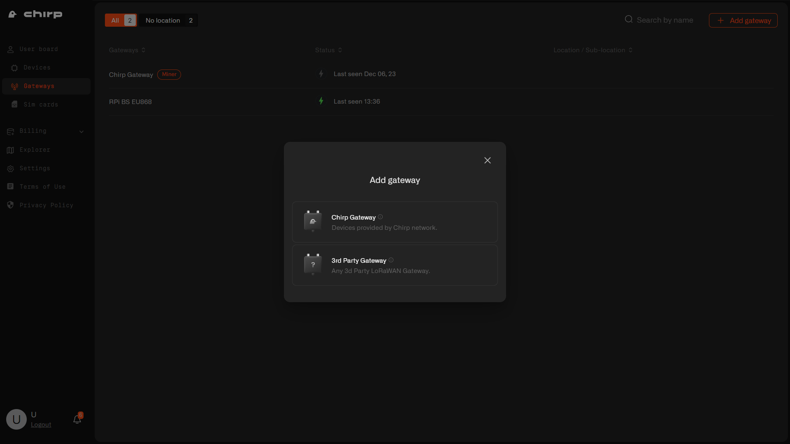

## Step 3

Enter the Gateway Name, select your country's LoRaWAN frequency band and input the Gateway EUI (located on the back of the gateway). Click Next.

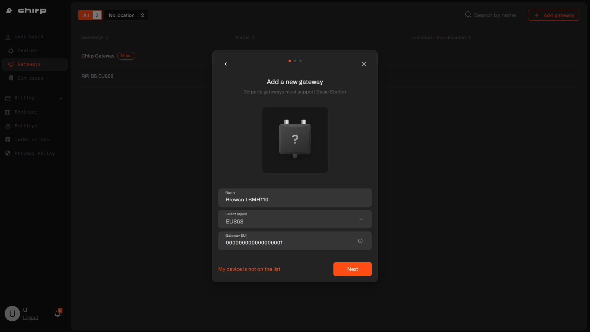

## Step 4

After adding the gateway, you'll receive a confirmation message. Copy and save the LNS Address, download and extract the certificates from the provided Zip file. Click Next.

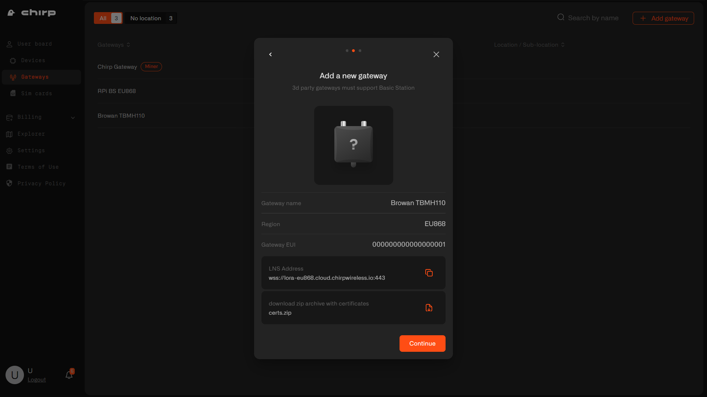

## Step 5

Now your gateway is successfully added to Chirp platform. Click Continue.

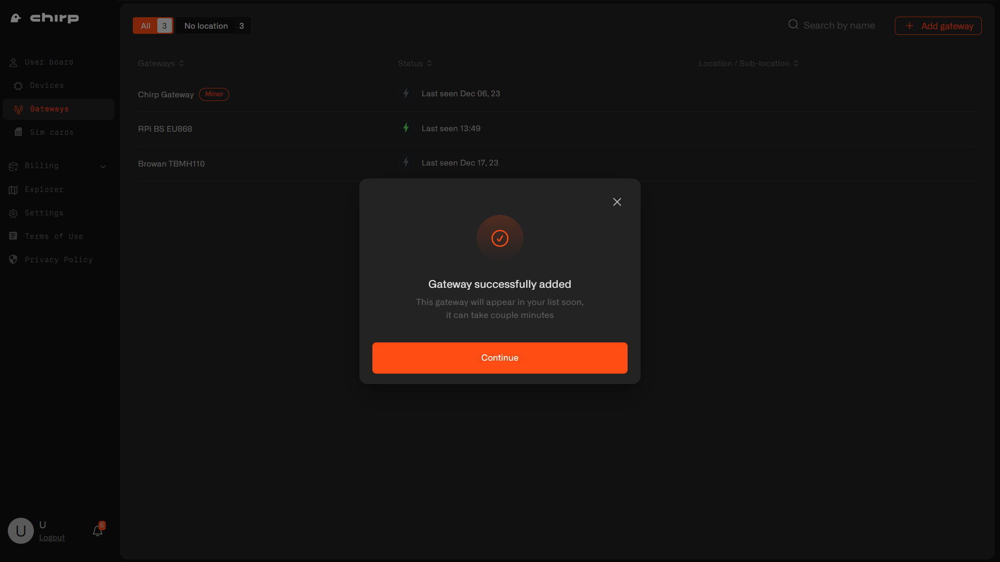

If you didn't save the certificates or LNS address, please, navigate to gateway's Settings tab.

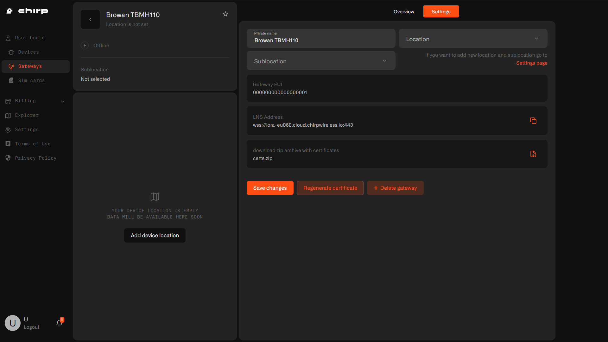

## Step 6

To connect the gateway to the Chirp network, plug in your Browan to an electrical outlet. Ensure the yellow light blinks slowly (indicating readiness for WiFi connection). Connect to your Browan Pro via WiFi; the password is on the gateway's back label.

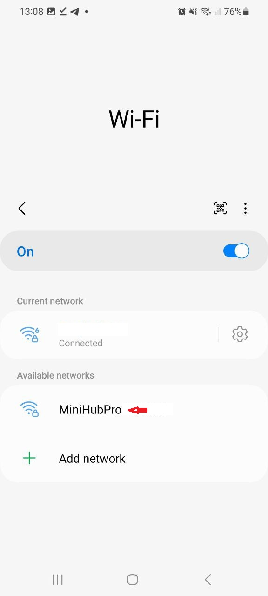

## Step 7

Once connected, navigate to 192.168.4.1 in your browser. **Important: Connect to WiFi last, as it will disconnect you from the gateway.**

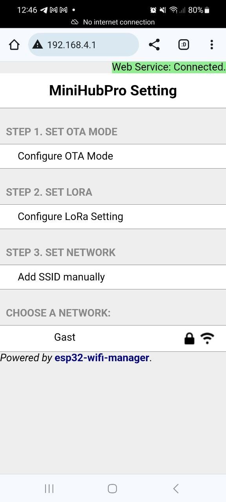

## Step 8

Enable OTA by clicking on Step 1 in the gateway's menu.

## Step 9

Click on step 2 "configure LoRa settings". Select LoRa Basics station and scroll to the bottom of the screen.

Enter the LNS Address that you have copied during gateway registration on Chirp's dashboard

For example: **wss://lora-eu868.cloud.chirpwireless.io:443**

Upload 3 certificates you have extracted from a Zip file in Step 4

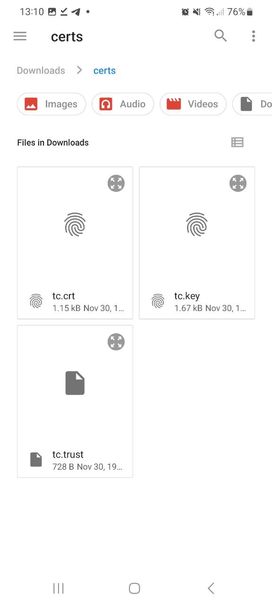

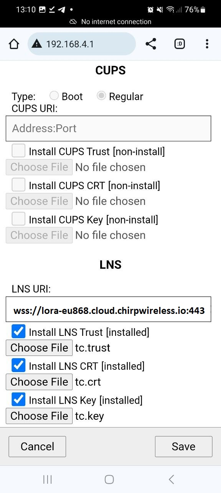

**Click Save**

## Step 10

To connect the gateway to your WiFi network, select "Set Network" or choose a visible network and enter the WiFi password. Note: You will lose connection to the gateway after connecting to WiFi.

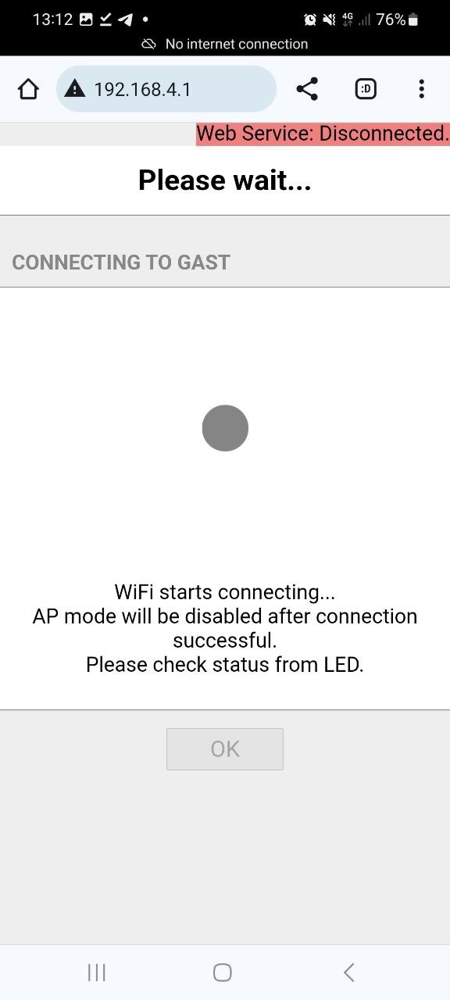

If set up correctly, a solid green light will appear on the gateway, and its status on the Chirp's dashboard will show as online.

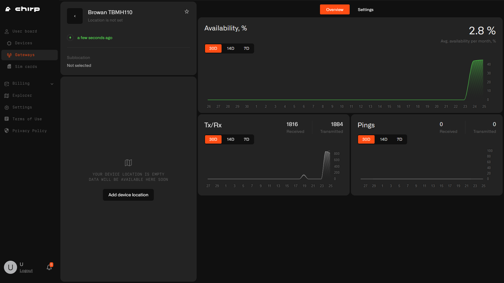

**Congratulations, your IoT devices are now ready to be added and you are ready to automate!**
