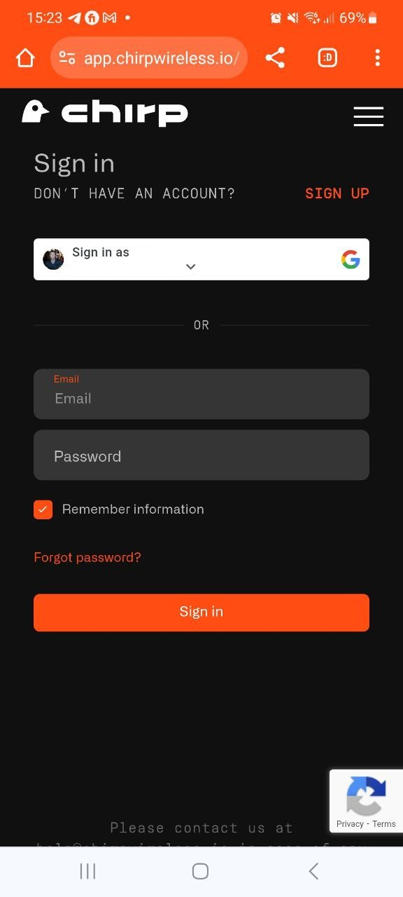
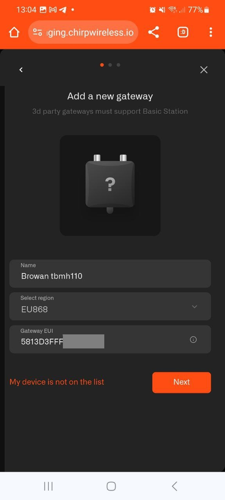

# Browan TBMH110

Please make sure that your model is ending on 110, model 100 is not supported on Chirps Network

## Step1

Navigate to app.chirpwireless.io and log in to your dashboard

## Step2

Once on your dashboard Click On Gateways

## Step3

Click on "Add gateway"

## Step4

Click on add 3d Party Gateway

## Step 5

Fill Out Gateway Name, Select your countries LoRaWAN frequency, and enter gateway EUI (Printed on the back of the gateway)

## Step 6

You will receive a message that gateway was successfully added. Now you need to copy the LNS Adress and save and extract the certificates from the Zip file.

## Step 7

Click next and you will receive a message that your Gatewway has been added. 

## Step 8

Now we need to connect to the gateway and load on it the certificates and connect it to WIFI so it can talk to the Chirp network.

Plug in your Browan into an electrical outlet. Double check that yellow light is slowly blinking. (you are now ready to connect to it wia WiFi). Open Wifi connections and connect to your Browan Pro the password to the gateway is printed on the back label.

## Step 9

Once connected, open your Browser and surf to 192.168.4.1 **(!!!Important! Save connecting to WIFI as a last step. you will be disconnected from the gateway once WIFI is activated!!!!)**

## Step 10

Click on Step 1 and make sure that OTA is enabled. 

## Step 11

Then Click on step 2 to configure LoRa settings. Select LoRa Basics station and scroll to the bottow.

Enter the LNS Address that you have copied during gateway registration on Chirps dashboard

wss://lora-eu868.cloud.chirpwireless.io:443

and upload 3 certificated that you have extracted from a Zip file in Step 6

Click Save

## Step 12

Now You are ready to connect to your WiFi network on the main menu of gateway configuration screen, click on step 3 Set Network
 or choose a network if you see it below. Enter your Wifi Password. Once you are connected to WiFi you will loose your connection to the gateway.

 If everything was configured correctly you will see a Solid green light on the gateway and the status of the gateway on Chirps dashboard will change to online.

 Congratulations you are now ready to add your IoT devices and automate!

