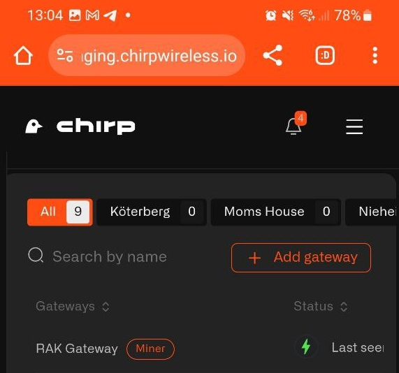
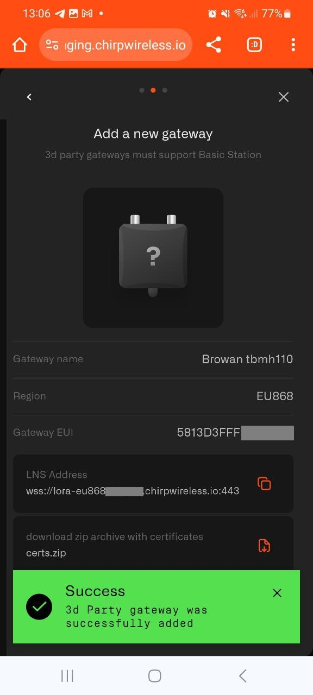
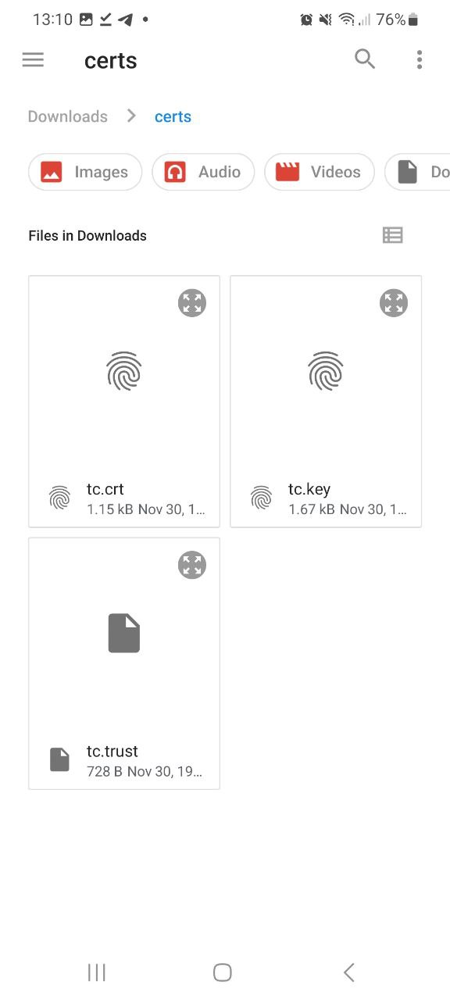

# Browan TBMH110

Ensure that your model ends with 110, as the model 100 is not compatible with the Chirps Network.

## Step1

Log in to your dashboard at app.chirpwireless.io

## Step2

Once logged in, click on "Gateways" in your dashboard.

## Step3

Select "Add gateway"

## Step4

Click on add 3d Party Gateway

## Step 5

Enter the Gateway Name, select your country's LoRaWAN frequency, and input the Gateway EUI (located on the back of the gateway).

## Step 6

After adding the gateway, you'll receive a confirmation message. Copy the LNS Address, download and extract the certificates from the provided Zip file.

## Step 7

Click next to receive a notification confirming your Gateway has been added.

## Step 8

To connect the gateway to the Chirp network, plug in your Browan to an electrical outlet. Ensure the yellow light blinks slowly (indicating readiness for WiFi connection). Connect to your Browan Pro via WiFi; the password is on the gateway's back label.

## Step 9

Once connected, navigate to 192.168.4.1 in your browser. **Important: Connect to WiFi last, as it will disconnect you from the gateway.**

## Step 10

Enable OTA by clicking on Step 1 in the gateway's menu.

## Step 11

Click on step 2 "configure LoRa settings". Select LoRa Basics station and scroll to the bottom of the screen.

Enter the LNS Address that you have copied during gateway registration on Chirps dashboard

**wss://lora-eu868.cloud.chirpwireless.io:443**

and upload 3 certificated that you have extracted from a Zip file in Step 6

**Click Save**

## Step 12

To connect the gateway to your WiFi network, select "Set Network" or choose a visible network and enter the WiFi password. Note: You will lose connection to the gateway after connecting to WiFi.

If set up correctly, a solid green light will appear on the gateway, and its status on the Chirps dashboard will show as online.

**Congratulations, your IoT devices are now ready to be added and automated!**
