# RAK 7268 V2

## Step1

Log in to your dashboard at app.chirpwireless.io

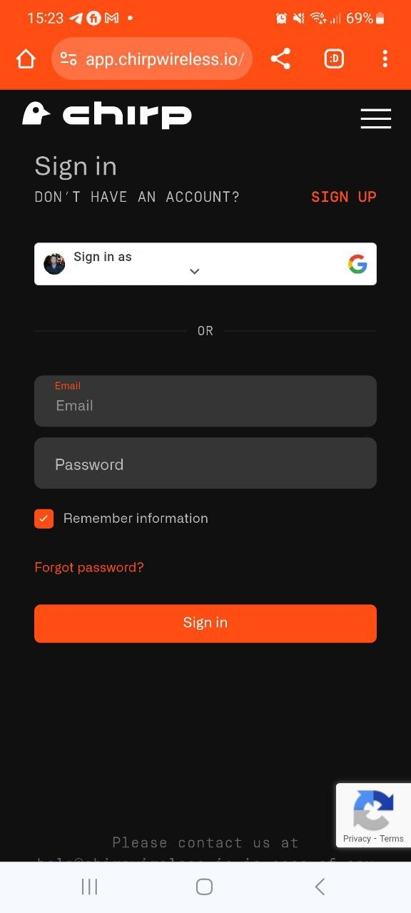

## Step2

Once logged in, click on "Gateways" in your dashboard.

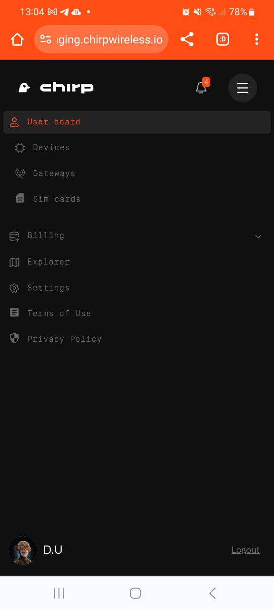

## Step3

Select "Add gateway"

## Step4

Click on add 3d Party Gateway

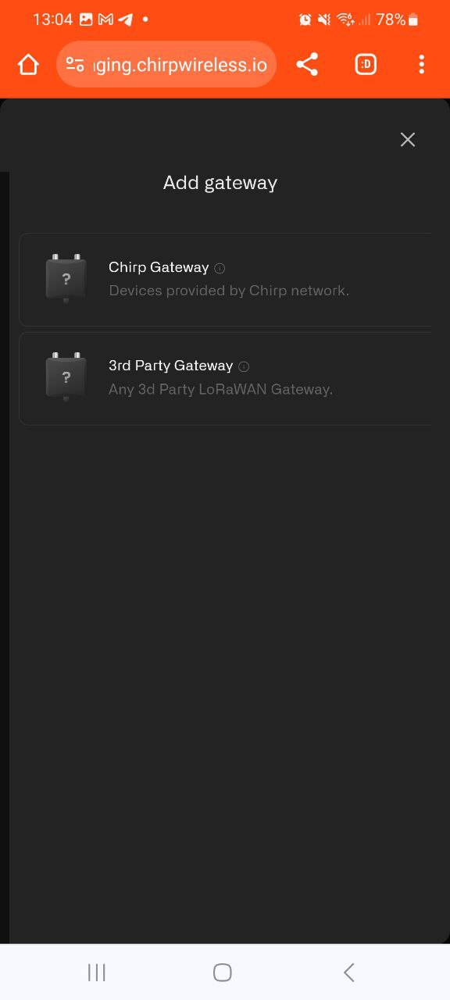

## Step 5

Enter the Gateway Name, select your country's LoRaWAN frequency, and input the Gateway EUI (GWEUI)(located on the back of the gateway).

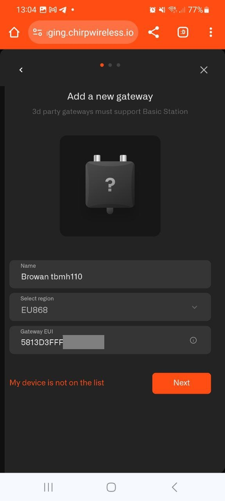

## Step 6

After adding the gateway, you'll receive a confirmation message. Copy the LNS Address, download and extract the certificates from the provided Zip file.

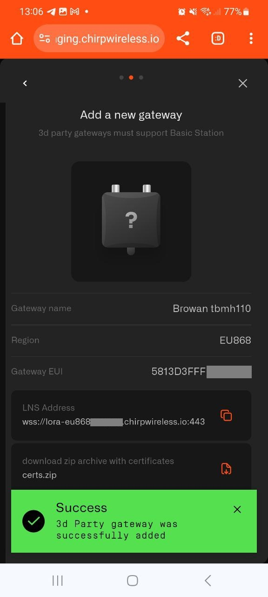

## Step 7

Click next to receive a notification confirming your Gateway has been added.

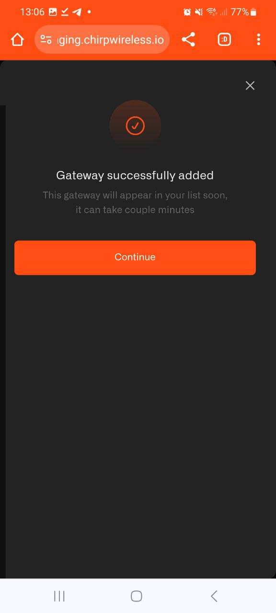

## Step 8

Plug in your RAK gateway to an electrical outlet and connect via an ethernet cable. 

## Step 9

Once connected, navigate to 192.168.230.1 in your browser. Username is root and you will be prompted to create a password, Select your country and frequency.

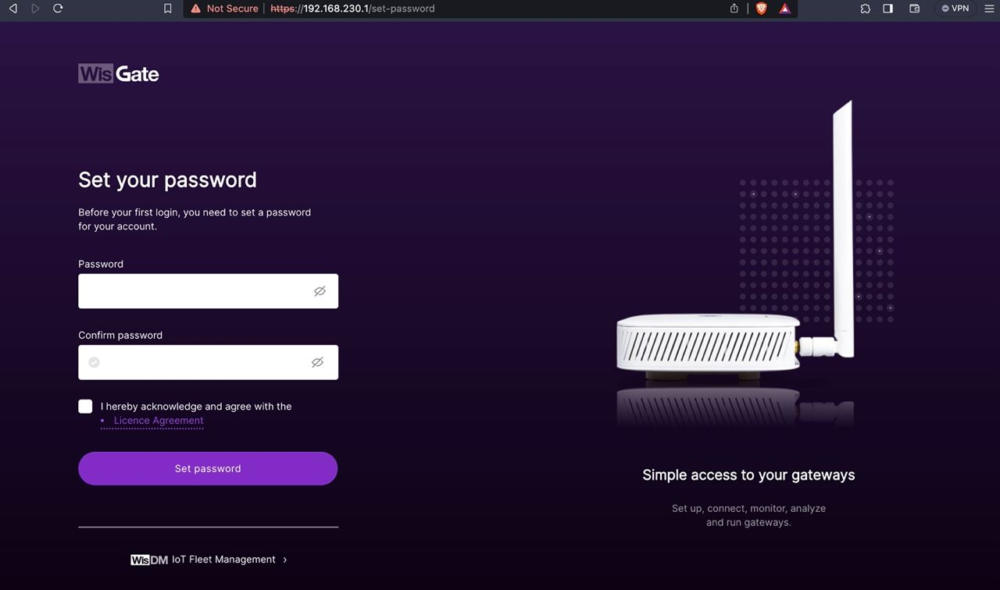

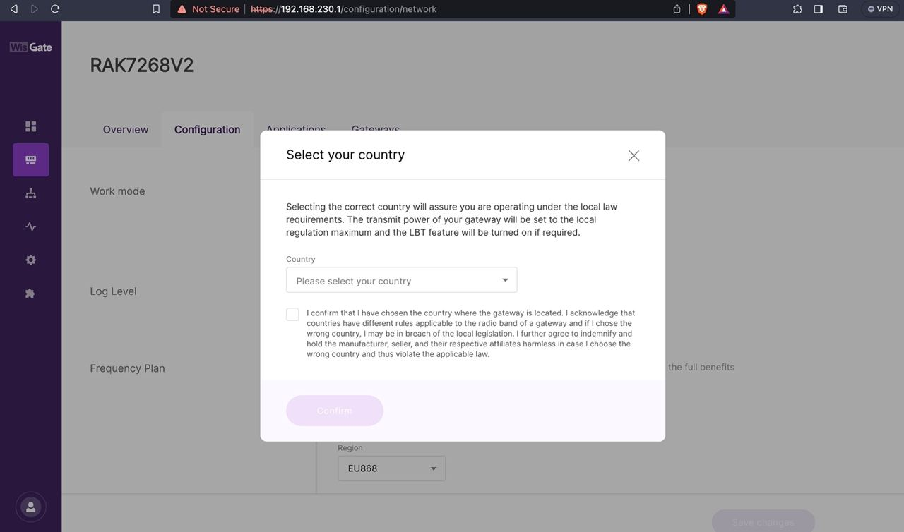

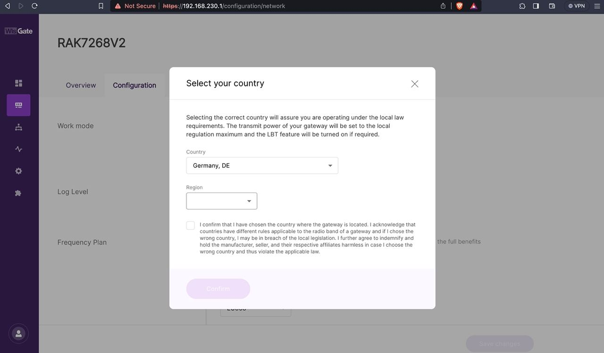

## Step 10

Click on the configuration tab. And Select LoRa Basics Station.

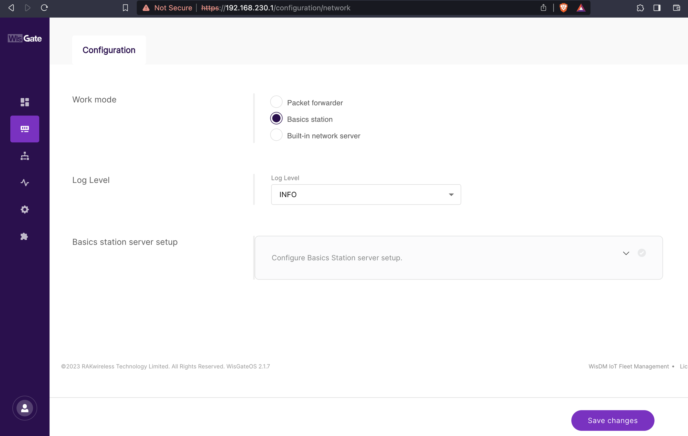

## Step 11

Scroll down and enter the LNS Address that you have copied during gateway registration on Chirps dashboard

**wss://lora-eu868.cloud.chirpwireless.io:443**

and upload 3 certificated that you have extracted from a Zip file in Step 6

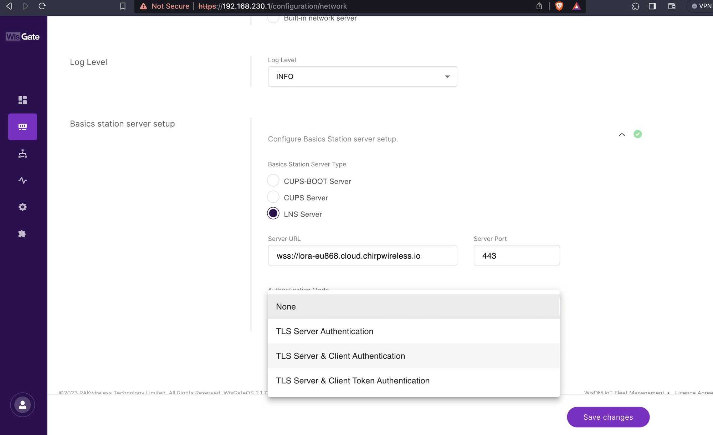

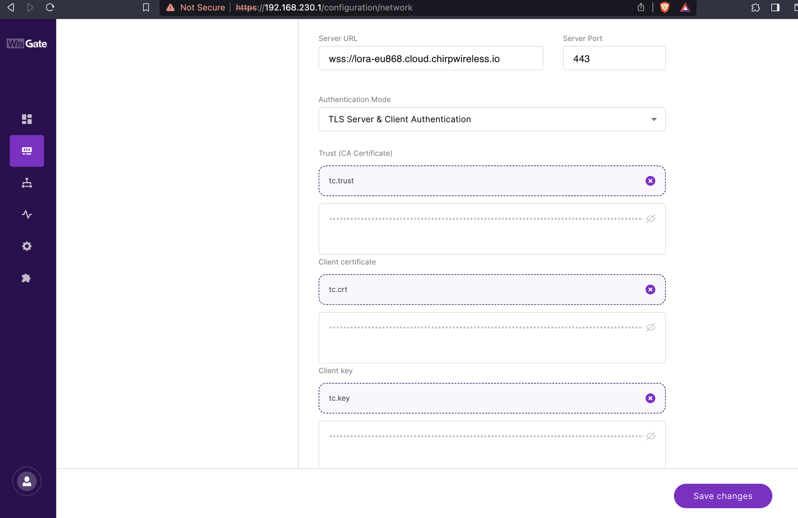

If set up correctly, gateways status on the Chirps dashboard will show as online.

**Congratulations, your IoT devices are now ready to be added and you are ready to automate!**
